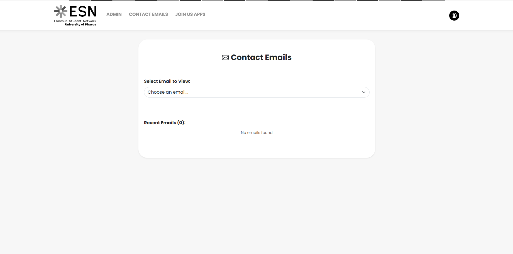

# ESN UniPi Admin Dashboard

[](https://esn-unipi-admin-12345.netlify.app/)
[](https://opensource.org/licenses/MIT)

The administrative control center for the **ESN UniPi Portal**. This application allows administrators to manage dynamic content, including news updates, event scheduling, and user submissions, providing a seamless bridge between the database and the public-facing portal.




## ✨ Core Features

* **Dynamic Content Management:** Create, update, and delete news articles and events in real-time.
* **Form Submission Tracking:** Centralized dashboard to view and manage inquiries from the "Join Us" and "Contact Us" forms.
* **Media Management:** Integrated file uploading to Cloudinary, ensuring optimized image handling for site content.
* **Responsive Admin UI:** A clean, sidebar-navigated interface optimized for desktop management of the ESN portal.
* **Secure Access:** Built to communicate with the ESN backend via protected API endpoints.

## 🛠️ Built With

<p align="left">
  
  
  
  
  
</p>

## 🚀 Getting Started

1. **Clone the repository:**
   ```bash
   git clone [https://github.com/filipposobrijanu/esn-unipi-admin.git](https://github.com/filipposobrijanu/esn-unipi-admin.git)
   cd esn-unipi-admin
