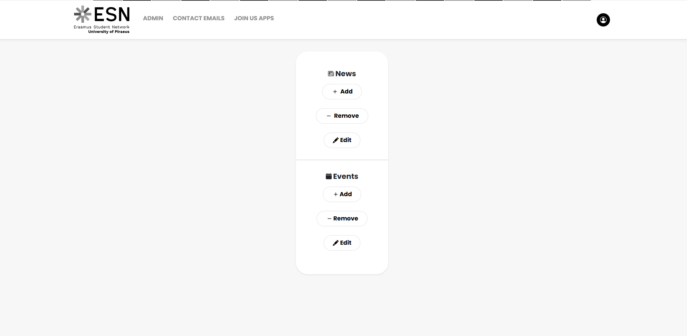
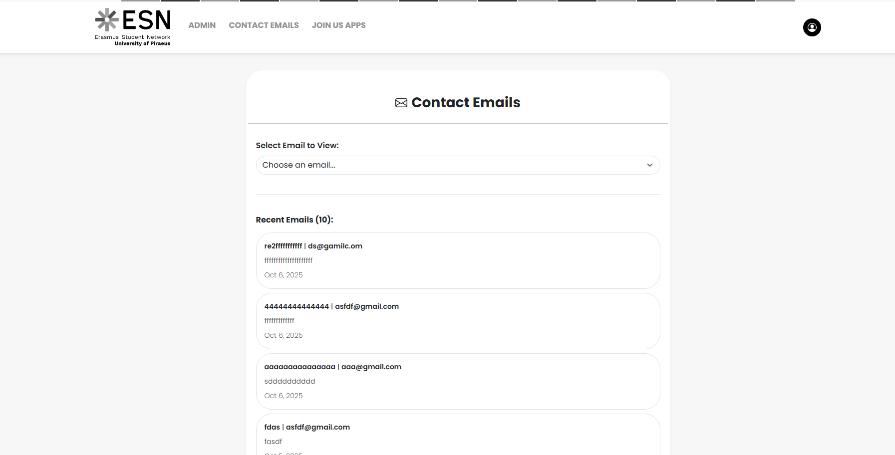
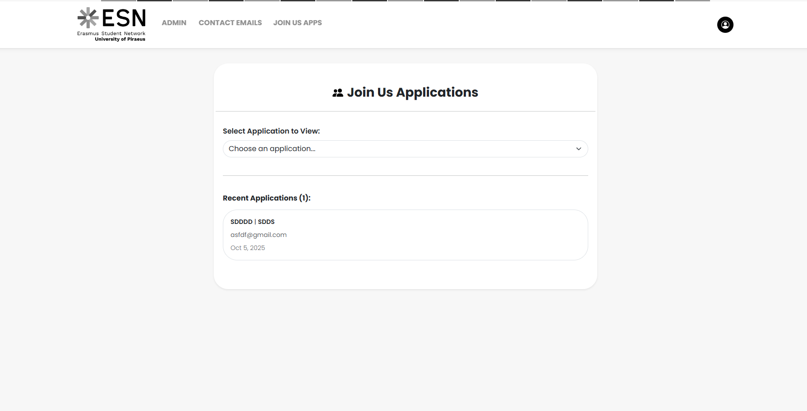
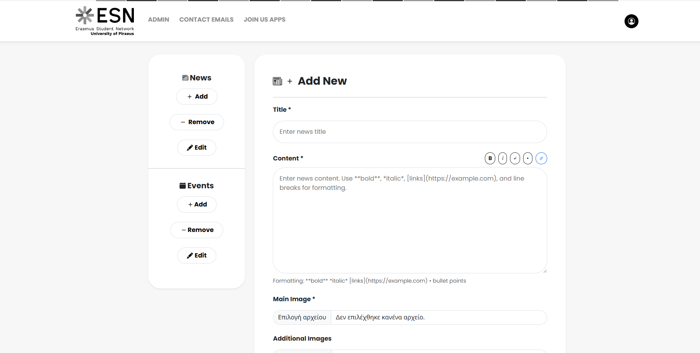

<h1 align="center">ESN UniPi Admin Dashboard</h1>
<h3 align="center">Enterprise Content Management Panel & CRUD Orchestration Engine</h3>

<p align="center">
  The administrative control center for the <strong>ESN UniPi Portal</strong> ecosystem. This application functions as a high-fidelity internal back-office suite, empowering administrators to orchestrate dynamic content, manage multi-channel feedback lifecycles, and handle secure media mutations via a production-grade, state-driven control layout.
</p>

<p align="center">
  <a href="https://esn-unipi-admin-12345.netlify.app/">
    
  </a>
  <a href="https://opensource.org/licenses/MIT">
    
  </a>
</p>

---

### ✨ Core Features

* **Full-Lifecycle CRUD Orchestration:** Abstracted event and news controllers executing real-time data mutations, structural schema validation, and immediate propagation across the public-facing client layout.
* **Centralized Input Audit Ledger:** Asynchronous workflow tables designed to monitor, filter, and track inbound user-generated applications from corporate entry vectors such as the "Join Us" and "Contact Us" forms.
* **Asynchronous Media Pipelines:** Zero-overhead client-side image processing linking directly with the Cloudinary API to handle on-the-fly multi-part asset streaming, optimization, and remote cloud storage.
* **Optimized Command Layout:** A clean, fixed-sidebar administrative UI built with high data density in mind, leveraging advanced layout primitives to ensure consistent performance for high-tempo moderation workflows.
* **Secured API Session Gateway:** Fully decoupled layout configured to coordinate exclusively with protected backend routing states via isolated bearer token request headers.

---

### 🛠️ Production Tech Stack

**Framework Architecture & View Engine**
<p align="left">
  
  
  
</p>

**Design Systems & Interface Primitives**
<p align="left">
  
  
  
</p>

**Data Pipeline, Network Networking & Media Asset Management**
<p align="left">
  
  
</p>

---

### 📸 Administrative Showcase

<p align="center">
  
  
</p>
<p align="center">
  
  
</p>

---

### 🚀 Setup & Local Development

**1. Clone the repository:**
```bash
git clone [https://github.com/filipposobrijanu/esn-unipi-admin.git](https://github.com/filipposobrijanu/esn-unipi-admin.git)
cd esn-unipi-admin
